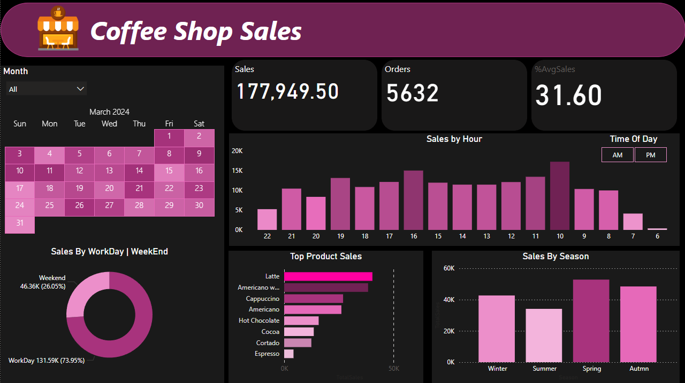

# ☕ Coffee Shop Sales Dashboard - Power BI

An interactive Power BI dashboard built to analyze and visualize coffee shop sales performance.  
This project was created as a **practice project** to improve skills in data cleaning, modeling, and dashboard design.

---

## 📊 Project Overview
The Coffee Shop Sales Dashboard provides insights into sales, orders, and top-performing products over time.  
It highlights sales trends by hour, weekday vs weekend, and seasonal performance to better understand customer behavior and overall business performance.

---

## 🧠 Data Preparation & Modeling
The dataset was cleaned and modeled inside Power BI:
- Removed duplicates and handled missing values.
- Created relationships between Date, Product, and Sales tables.
- Designed a Star Schema model for performance optimization.
- Added calculated columns for Time of Day, Season, and Workday/Weekend.

---

## 📈 Dashboard Insights
- **Total Sales:** 177,949.50  
- **Total Orders:** 5,632  
- **Average Sales per Order:** 31.60  
- **Top Products:** Latte, Americano, Cappuccino  
- **Peak Hours:** Between 10 AM – 4 PM  
- **Sales by Season:** Spring achieved the highest sales.  
- **Workday vs Weekend:** Workdays contributed around 74% of total revenue.

---

## 🧰 Tools Used
- **Power BI** – Data modeling, visualization, and report building  
- **Excel / CSV** – Data source  
- **DAX** – For creating custom calculations and KPIs  

---

## 🧾 Key Learnings
- Practiced data cleaning and model design in Power BI.  
- Enhanced understanding of data relationships and hierarchies.  
- Improved dashboard layout, slicer usage, and user interactivity.  

---

## 📷 Dashboard Preview

---

## 🚀 Future Improvements
- Add customer demographic analysis.  
- Integrate real-time data connections.  
- Include profit and cost performance insights.  

---
## 📂 Repository Structure
- [CoffeeShop_Sales.xlsx](./CoffeeShop_Sales.xlsx)→ raw dataset  
- [demooo.pbix](./demooo.pbix)→ PowerBI Project
## 👨‍💻 Author
**Mohamed Hani**  
🔗 [LinkedIn](https://www.linkedin.com/in/mohamed-hani-721681243/)  
🐙 [GitHub](https://github.com/MohamedHani22-mo)

